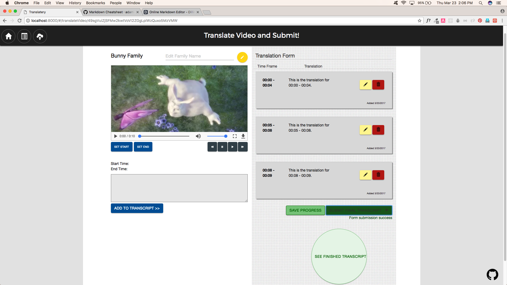
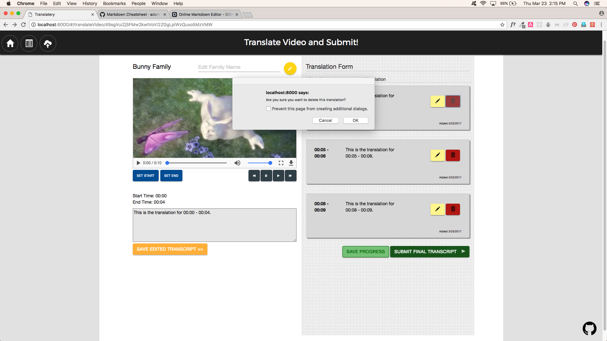
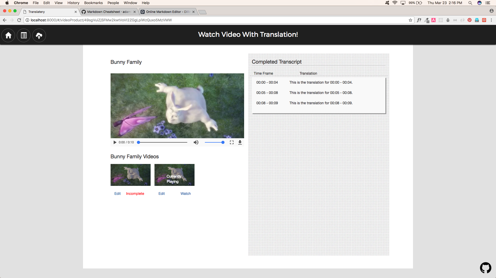

# New Story Video Translation Tool 

#### Description/Overview
Our translation tool allows users from [New Story](https://www.newstorycharity.org/) to view, upload and translate videos from their charity. They crowdfund homes and "transform slums into thriving communities." By changing lives through building safe and resilient communities and allowing donors to see where their contributions are being allocated, New Story provides a fresh approach to philanthropy.

[Live URL](http://www.annasedlar.com/Story-Translate/frontend/#/login)

#### Table of contents

[Description/Overview](#description/overview) | [Technologies Used](#technologies) | [Challenges and Solutions](#challenges-and-solutions)| [GitHub Link](#github-link) | [Code Snippets and Screenshots](#code-snippets-and-screenshots) | [MVP](#mvp-minimal-viable-product) | [Stretch Goals](#stretch-goals) | [Team Members and Contributions](#team-members-and-contributions) | [Project Timeline](#project-timeline)


#### Technologies
The following languages and frameworks were used:

  * HTML

  * CSS

  * SASS

  * Javascript

  * JQuery

  * Angular 1.5

  * Bootstrap

  * Materialize

  * Node.js

  * MySQL


#### Challenges and Solutions
1. **Challenge:** Learning and utilizing Angular to complete this project

   **Solution:** logic to delete group and individual videos, logic to target start and end times in transcript (no overlapping times), linking transcript to the correct video and having it show up when the user returns to the session at a later time

2. **Challenge:** Using the video element in HTML5

   **Solution:** SCE in Angular, grabbing screenshots, displaying subs in video at the right time, logic to get "currentlyPlaying" only displaying on the video that is playing. when you click watch, video clicked will bring up corresponding transcript. entire transcript displays on the right while the corresponding line displays in the video at that time frame. html5 doesn't recognize video as "safe". we did a lot of searching and most of the answers were that there is no fix to the issue.

3. **Challenge:** Size of videos, how to store them, how to upload them, how to pull that info back out

   **Solution:** Multer: when you upload a video through Multer, the actual file gets saved to the backend, and the name, path, token of the video is saved in the database. we didn't want to save it to DB b/c the file name would be a long string of characters. needed a more efficient way ==> multer. Utilizing multer was complicated by the fact that we had just learned Angular the week before. (By not saving the entire video in the db, we were able to keep our db small.)


#### GitHub Link
[New Story Translation Tool](https://github.com/annasedlar/Story-Translate)

#### Code Snippets and Screenshots

This is the code behind our "Videos to Translate" page. We have logic dictating how each video will be displayed. The videos are grouped by family name, a field that can be edited on the translateVideo and finishedProduct routes. 


For a more pleasant user experience, the upload button is available on all routes with a default field of the family name. Each video is clearly marked as complete or incomplete and there are options on all videos to continue editing the transcript. You can only view the final product when the translation has been submitted as "complete." 







There is also an option to delete individual videos or an entire family of videos (for example when video translation and compilation is complete for that family). Using the same logic that we used to mark whether a video is "complete" or "incomplete", we marked the videos on the final product page with "Currently Playing" if the user has clicked watch on any of the related videos.
 
```javascript
$scope.videoData = videoData

var tempFamilyName = '';
$scope.videoData.data.map((video, index)=>{
    var myUrl = 'http://annasedlar.com:3000/videos/' + video.name
    video.name = $sce.trustAsResourceUrl(myUrl)
    if(!index){
        tempFamilyName = video.familyName
        // video.skipClass = 'hide-class'
    }else if(video.familyName.toUpperCase() == tempFamilyName.toUpperCase()){
        video.familyName = ''
        video.skipClass = 'hide-class'
    }else{
        tempFamilyName = video.familyName
        video.skipClass = 'nothing'
    }
    if(video.finished){
        video.finished = ''
        video.classStyle = 'video-complete'
        video.checkItOutClass = ''   
    }else{
        video.finished = 'Incomplete'
        video.classStyle = 'video-incomplete'
        video.checkItOutClass = 'displayNone'
    }

```

We needed a way to monitor the time range on the translations. The start and end times cannot overlap the time range of a transcript that has already been submitted. We needed a way to check the beginning time of the potential new translation against all the beginning times of the translations that have already been submitted to see if there are conflicts with any of the previously submitted time ranges. This code snippet is from a function on the translate video page.


```javascript

var inBetween = true
    for(let j = 0; j<tempRange.length; j++){
      if(endTime < tempRange[j].startTime){
      }else{
        inBetween = false
      }
    }  
    
    var beforeEverything = true;
    for(let i = 0; i < timeRangeArray.length; i++){
      if((endTime < timeRangeArray[i].startTime)&&(endTime < timeRangeArray[i].endTime)){
      }else{
        beforeEverything = false;
      }
    }
    
    var afterEverything = true;
    for(let i = 0; i<timeRangeArray.length; i++){
      if((startTime > timeRangeArray[i].startTime)&&(startTime > timeRangeArray[i].endTime)){
      }else{
        afterEverything = false;
      }
    }  
    console.log(inBetween, beforeEverything, afterEverything)
    if(((inBetween)||(beforeEverything)||(afterEverything))&&(startTime < endTime)){
      timeRangeArray.push({
        startTime: startTime,
        endTime: endTime
      })
```

On the final page, you can see the entire transcript on the right. Subs on the video as it plays. User has the option to see other videos related to this family. Has option to continue translating other videos or watching other finished videos.



#### MVP (Minimal Viable Product)

* Ability to upload content

* Submit translations based on video time frames

* Form that saves to database

* Display a list of videos sorted by family and categorized by completion status


#### Stretch Goals

* Token authentication system

* Displaying completed translations from transcipt as video plays

* Admin dashboard - user can see who translated which videos, when, how often, etc

* Upload multiple videos at once


#### Team Members and Contributions
All team members are full stack web development students of the DigitalCrafts November 2016 cohort. This project utilizes both our frontend and backend skills that we have learned along with pair programming and SCRUM agile development methodology.


* [Paul Kang](https://github.com/pdwkang) 

**Role:** MVP

**Contributions:** Lead development. Resolved coding challenges team members faced throughout the project. Wrote custom algorithm to detect translation time range overlaps. Organized styling and functionality to bring project to desired levels of functionality.


* [Anna Sedlar](https://github.com/annasedlar) 

**Role:** SCRUM Master

**Contributions:** Maintained schedule and timeframe for resolving issues and making rapid progress in order to hit targets. Designed functionality and styles of translation form page, contributed to the routing in response to user activity. Initiated external communication with the New Story team.

* [Connie Dang](https://github.com/dangconnie) 

**Role:** Wordsmith

**Contributions:** Configured uploading functionality. Organized and styled multiple pages including the final transcript page to ensure consistency across the application. Wrote ReadMe file to make the project accessible and presentable.


#### Project Timeline
Project start: 3/6/2017
Project completion: 3/24/2017