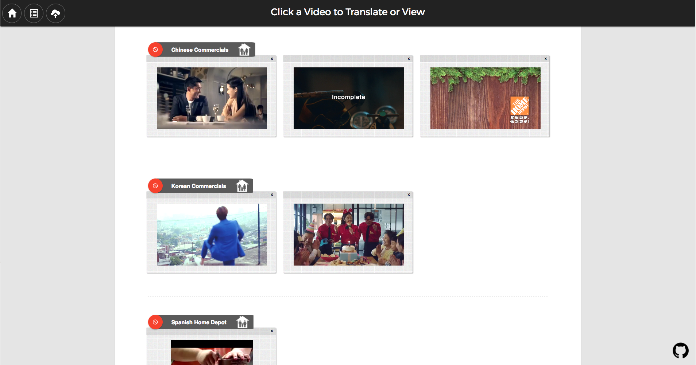
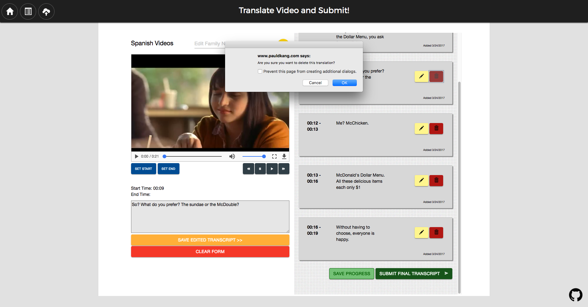

# New Story Video Translation Tool 

#### Description/Overview
Our translation tool allows users from [New Story](https://www.newstorycharity.org/) to view, upload and translate videos from their charity. They crowdfund homes and "transform slums into thriving communities." By changing lives through building safe and resilient communities and allowing donors to see where their contributions are being allocated, New Story provides a fresh approach to philanthropy.

[Live URL](http://www.pauldkang.com/new_story/#/)


#### GitHub Link
[New Story Translation Tool](https://github.com/annasedlar/Story-Translate)

#### Table of contents

[Description/Overview](#description/overview) | [GitHub Link](#github-link) | [Technologies Used](#technologies) | [Challenges and Solutions](#challenges-and-solutions) | [Code Snippets and Screenshots](#code-snippets-and-screenshots) | [MVP](#mvp-minimal-viable-product) | [Stretch Goals](#stretch-goals) | [Team Members and Contributions](#team-members-and-contributions) | [Project Timeline](#project-timeline)


#### Technologies
The following languages and frameworks were used:

  * HTML

  * CSS

  * SASS

  * Javascript

  * JQuery

  * Angular 1.5

  * Bootstrap

  * Materialize

  * Node.js

  * Express

  * MySQL


#### Challenges and Solutions
1. **Challenge:** Learning and utilizing Angular 1.5 to complete this project

   **Solution:** Our group decided to learn Angular 1.5 for this project. Since we were not very familiar with this framework, we were unaware of what tools it had to offer. As a result, building with this Angular was an exciting challenge. Our self-teaching skills after our instructor's introduction to Angular were put to the test when we decided that we needed a function for the user to save sessions. We needed to link the videos to their corresponding transcripts as well as mark which videos had translations in progress. We were able to accomplish this task with instructor assistance, much Googling and trial and error. Other issues stemming from the novelty of this framework included issues with using a video element in HTML5 and storing videos and its identifying elements.
    

2. **Challenge:** Using the video element in HTML5

   **Solution:** One major issue was adding a video to our app with Angular. Unknown to us at the time, completing this task would require a few more steps than what we were used to. Our problem was best stated in [Ruben Canton](http://www.rubencanton.com/blog/2014/07/adding-video-src-with-angular.html)'s words: "Angular allows you to set an image “src” or the href of a link without issues, but blocks you if you try to add the “src” of an HTML5 video element." Most of the sources we found on Google stated that there is currently no fix for this issue. After an extensive search, we would like to credit Canton's detailed solution to work around this problem. In order to add the video source to our project, we had to tell Angular that this is a safe operation using Angular's Strict Contextual Service (SCE). As a result, we included `$scope.trustedUrl = $sce.trustAsResourceUrl(myUrl);` in our code.


3. **Challenge:** Size of videos, how to store them, how to upload them, how to retrieve that video's information

   **Solution:** Since our app's main purpose is to faciliatate the translation process for New Story's users, we needed an efficient way to store and retrieve videos and transcripts. Enter Multer. When uploading a video through Multer, the actual video is saved to the backend while the name, path and token of the video are saved in the database. By splitting up the video with its identifying elements, we eliminated the need to store the video as a long string in our database. Therefore, we were able to keep our database small while keeping the transcripts linked to the correct videos. Bringing Multer into our app was complicated by the fact that we had just learned Angular the week before.


#### Code Snippets and Screenshots

Front page requiring user login


After the user is logged in, he has an option of uploading a video or viewing a list of videos in the database. If he chooses to upload first, he will be redirected to the same list route after the page reloads.


 
This is the code behind our "Videos to Translate" page. We have logic dictating how each video will be displayed. The videos are grouped by family name, a field that can be edited on the video translation and finished product routes. 
```javascript
$scope.videoData = videoData

var tempFamilyName = '';
$scope.videoData.data.map((video, index)=>{
    var myUrl = 'http://annasedlar.com:3000/videos/' + video.name
    video.name = $sce.trustAsResourceUrl(myUrl)
    if(!index){
        tempFamilyName = video.familyName
        // video.skipClass = 'hide-class'
    }else if(video.familyName.toUpperCase() == tempFamilyName.toUpperCase()){
        video.familyName = ''
        video.skipClass = 'hide-class'
    }else{
        tempFamilyName = video.familyName
        video.skipClass = 'nothing'
    }
    if(video.finished){
        video.finished = ''
        video.classStyle = 'video-complete'
        video.checkItOutClass = ''   
    }else{
        video.finished = 'Incomplete'
        video.classStyle = 'video-incomplete'
        video.checkItOutClass = 'displayNone'
    }

```
For a more pleasant user experience, the upload button is available on all routes with a default field of the family name. Each video is clearly marked as complete or incomplete and there are options on all videos to continue translating. The final product is only viewable when the translation has been submitted as "complete." 


There is also an option to delete individual videos or an entire family of videos (for example when video translation and compilation is complete for that family). Using the same logic that we used to mark whether a video is "complete" or "incomplete", we marked the videos on the final product page with "Currently Playing" if the user has clicked "watch" on any of the related videos. This would help the user keep track of each video's translation status.



Verifying the time ranges for each translation is crucial. The start and end times cannot overlap with the time range of a transcript that has already been submitted. We needed to check the beginning time of the potential new translation against all the ending times of the translations that have already been submitted to see if there are conflicts with any of the previously submitted time ranges. The code below takes care of this task.


```javascript

var inBetween = true
    for(let j = 0; j<tempRange.length; j++){
      if(endTime < tempRange[j].startTime){
      }else{
        inBetween = false
      }
    }  
    
    var beforeEverything = true;
    for(let i = 0; i < timeRangeArray.length; i++){
      if((endTime < timeRangeArray[i].startTime)&&(endTime < timeRangeArray[i].endTime)){
      }else{
        beforeEverything = false;
      }
    }
    
    var afterEverything = true;
    for(let i = 0; i<timeRangeArray.length; i++){
      if((startTime > timeRangeArray[i].startTime)&&(startTime > timeRangeArray[i].endTime)){
      }else{
        afterEverything = false;
      }
    }  
    console.log(inBetween, beforeEverything, afterEverything)
    if(((inBetween)||(beforeEverything)||(afterEverything))&&(startTime < endTime)){
      timeRangeArray.push({
        startTime: startTime,
        endTime: endTime
      })
```

On the final page, the user can see the entire transcript on the right. As the video plays, the submitted translations appear on the video as subtitles. On this page, the user has the option to see other videos related to this family, continue translating the other videos or watch finished videos.


#### MVP (Minimal Viable Product)

* Ability to upload content

* Ability to submit legitimate translations based on video time frames

* Form that saves translations to database

* Displaying a list of videos sorted by family and categorized by completion status


#### Stretch Goals

* Token authentication system 

* Displaying completed translations from transcipt as the video plays

* An administrative dashboard where the user can see who translated which videos, when, how often, etc

* Ability to upload multiple videos at once


#### Team Members and Contributions
All team members are full stack web development students of the [DigitalCrafts](http://www.digitalcrafts.com/) November 2016 cohort. This project utilizes both our frontend and backend skills along with pair programming and SCRUM agile development methodology.


* [Paul Kang](https://github.com/pdwkang) 

**Role:** MVP

**Contributions:** Lead development. Resolved coding challenges team members faced throughout the project. Wrote custom algorithm to detect translation time range overlaps. Organized styling and functionality to bring project to desired levels of functionality.


* [Anna Sedlar](https://github.com/annasedlar) 

**Role:** SCRUM Master

**Contributions:** Maintained schedule and timeframe for resolving issues and making rapid progress in order to hit targets. Designed functionality and styles of translation form page, contributed to the routing in response to user activity. Initiated external communication with the New Story team.

* [Connie Dang](https://github.com/dangconnie) 

**Role:** Wordsmith

**Contributions:** Configured uploading functionality. Organized and styled multiple pages including the final transcript page to ensure consistency across the application. Wrote ReadMe file to make the project accessible and presentable.


#### Project Timeline
* Project start: 3/6/2017

* Project completion: 3/24/2017